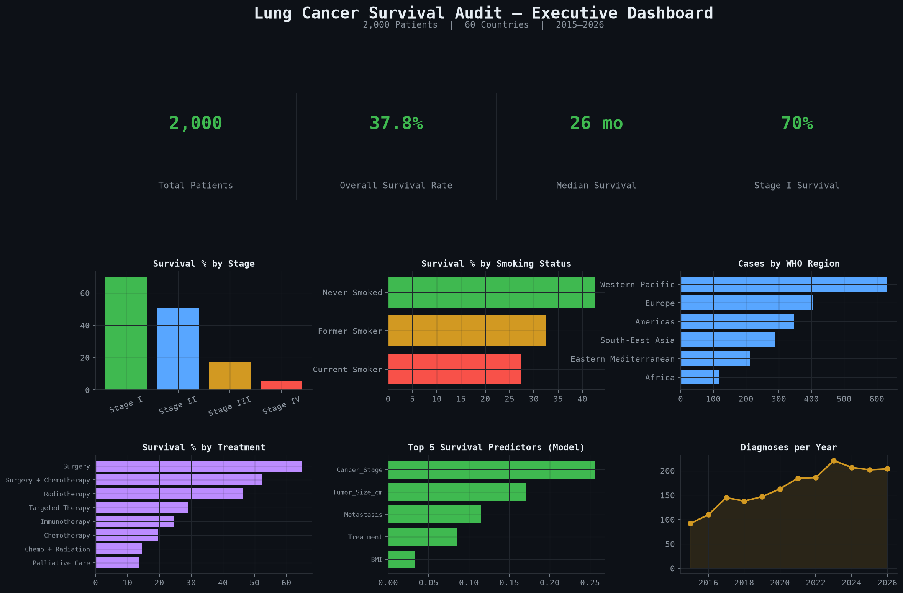
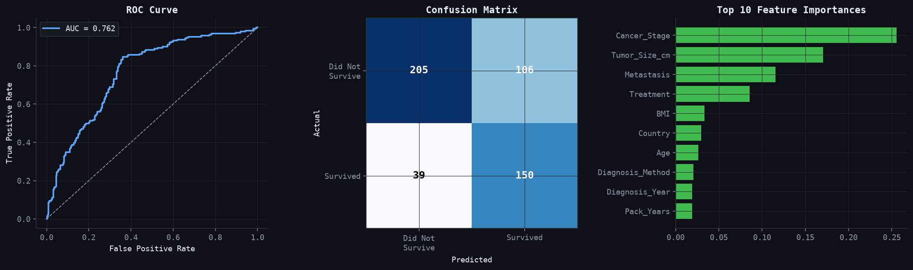

# Who Beats Lung Cancer? Decoding Survival Odds

A clinical risk-factor and survival audit of **2,000 lung cancer patients across 60 countries (2015–2026)**, built as an end-to-end data analysis and machine learning notebook.

## 📌 Overview

Lung cancer remains the leading cause of cancer death worldwide, but survival is far from uniform. This project audits a multi-country patient-level dataset to answer:

- Which risk factors (smoking, occupational exposure, genetics) actually separate survivors from non-survivors?
- Does stage at diagnosis dominate every other variable, or do treatment and biology still move the needle?
- Which genetic mutations and treatments are associated with the best outcomes?
- Can a model built from data available at diagnosis meaningfully predict survival — and how honest is that model, really?

## 🔍 Key Findings

- **Stage dominates.** Survival collapses from ~70% at Stage I to ~5% at Stage IV — the single strongest driver in the dataset.
- **Risk factors stack.** Survival declines steadily as the count of concurrent risk factors rises — a dose-response pattern, not one dominant cause.
- **Smoking status is graded.** Never-smokers > former smokers > current smokers, in that order, on survival.
- **Treatment comparisons are confounded by stage.** Surgery and targeted therapy look "better" partly because they're disproportionately used in earlier-stage disease.
- **Genetic mutations show little separation** in this cohort — no clear EGFR/ALK targeted-therapy survival edge, a useful reminder to validate against clinically-sourced data.
- **A Random Forest model** trained on diagnosis-time features reaches **ROC-AUC 0.76**, led by Cancer Stage, Tumor Size, and Metastasis — consistent with real oncology, not a modeling artifact.

## 📊 Executive Dashboard



## 🧪 Model Performance



| Metric | Score |
|---|---|
| Accuracy | 0.70 |
| ROC-AUC | 0.76 |
| Recall (Survived) | 0.77 |

## 🛠️ Tools & Methods

- **Python:** pandas, NumPy for data wrangling
- **Visualization:** matplotlib, seaborn (custom dark clinical theme)
- **Modeling:** scikit-learn (Random Forest, Logistic Regression baseline, ROC/AUC evaluation)
- **Notebook:** Jupyter, fully executed end-to-end

## 📁 Repository Structure

```
├── lung_cancer_survival_audit.ipynb   # Full analysis notebook
├── lung_cancer_dataset.csv            # Source data (2,000 patients, 46 fields)
├── README.md
└── charts/                            # Exported chart images
```

## ⚠️ Disclaimer

This is a data analysis exercise on a synthetic/aggregated dataset and is **not** a substitute for clinical research or medical advice.

## 👤 Author

**Zohair Baloch** — Data Analyst
[Kaggle](https://www.kaggle.com/zohairbaloch) · [GitHub](https://github.com/zohairbaloch-64) · [LinkedIn](https://www.linkedin.com/in/zohair-baloch-data-analyst)
